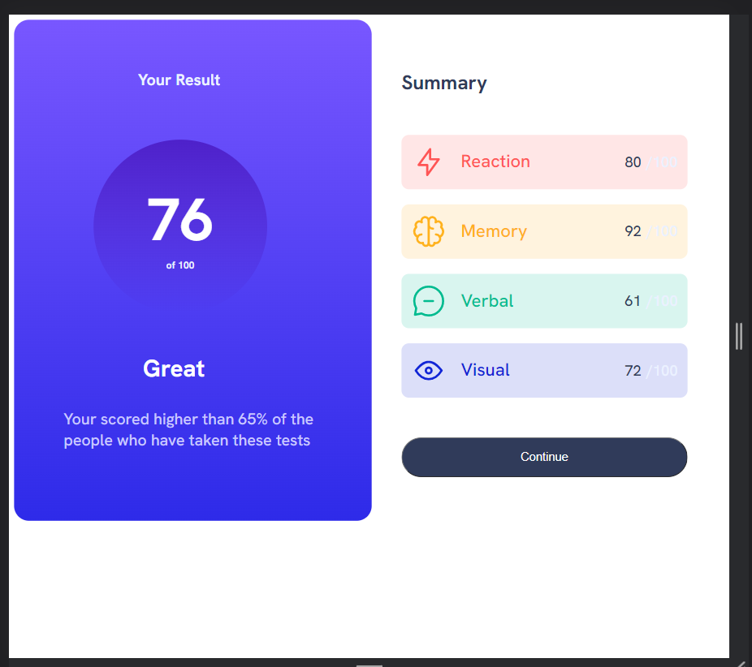

# Frontend Mentor - Results summary component solution

This is a solution to the [Results summary component challenge on Frontend Mentor](https://www.frontendmentor.io/challenges/results-summary-component-CE_K6s0maV). Frontend Mentor challenges help you improve your coding skills by building realistic projects. 

## Table of contents

- [Overview](#overview)
  - [The challenge](#the-challenge)
  - [Screenshot](#screenshot)
  - [Links](#links)
- [My process](#my-process)
  - [Built with](#built-with)
  - [What I learned](#what-i-learned)
- [Author](#author)
- [Acknowledgments](#acknowledgments)

## Overview

### The challenge

Users should be able to:

- View the optimal layout for the interface depending on their device's screen size
- See hover and focus states for all interactive elements on the page

### Screenshot

### Links

- Solution URL: 
- Live Site URL: 

## My process

### Built with

- Semantic HTML5 markup
- CSS custom properties
- Flexbox

### What I learned

By doing this front mentor challenge I learned how to use css tools, in conjunction with html. during the course I was able to explore responsive design and apply the front end development knowledge I acquired through courses and bootcamps.

## Author

- Website - [Fernanda Perez](https://ferperezm28.github.io/)
- Frontend Mentor - [@Ferperezm28](https://www.frontendmentor.io/profile/Ferperezm28)
- Linkedin - [Fernanda Perez](https://www.linkedin.com/in/ferperezm28/)

## Acknowledgments

This project was done as part of an assignment for a technolatinas bootcamp in web development, in May 2023.
